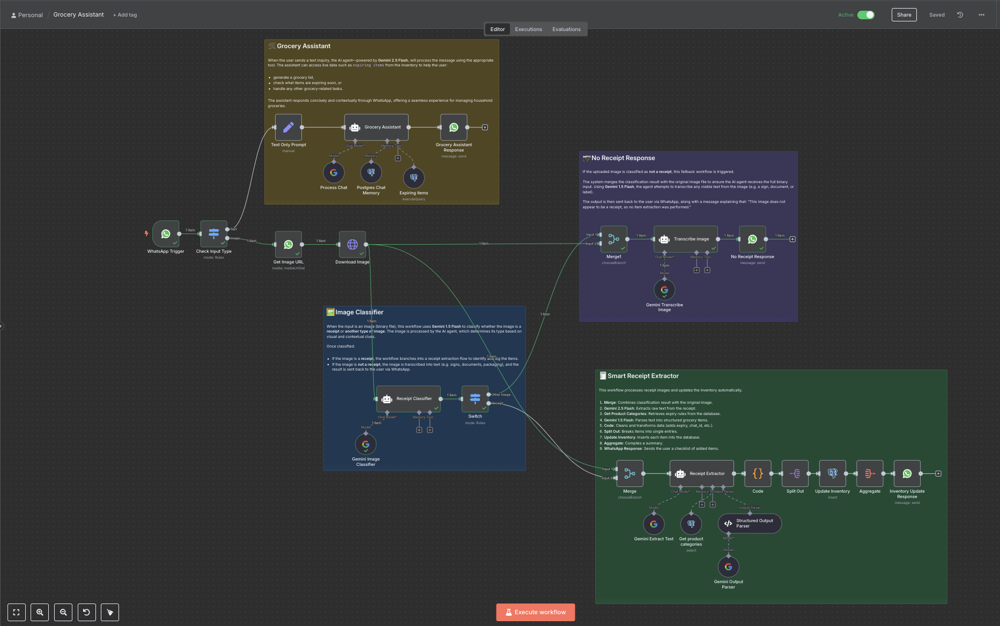
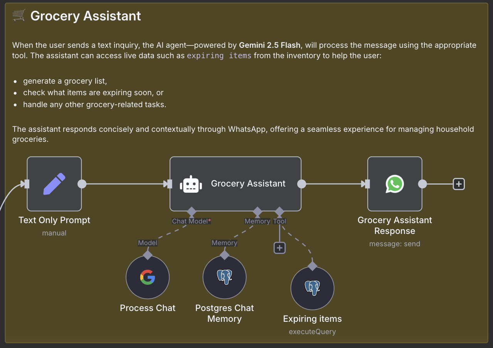
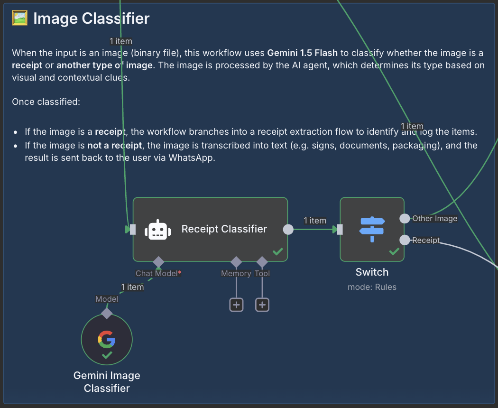
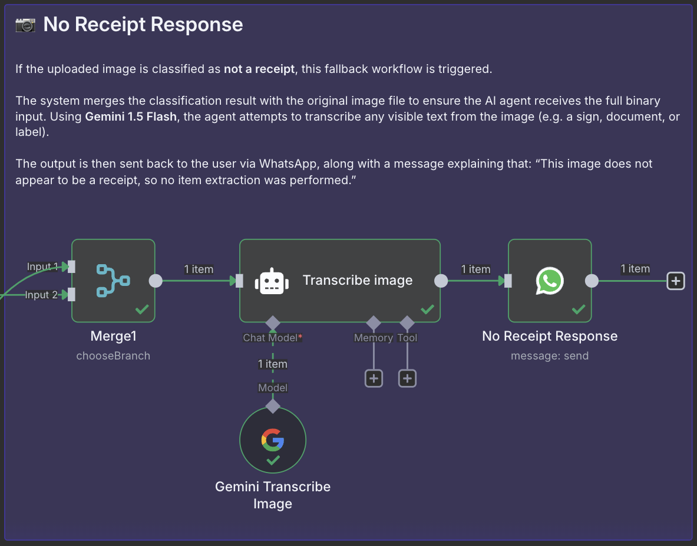
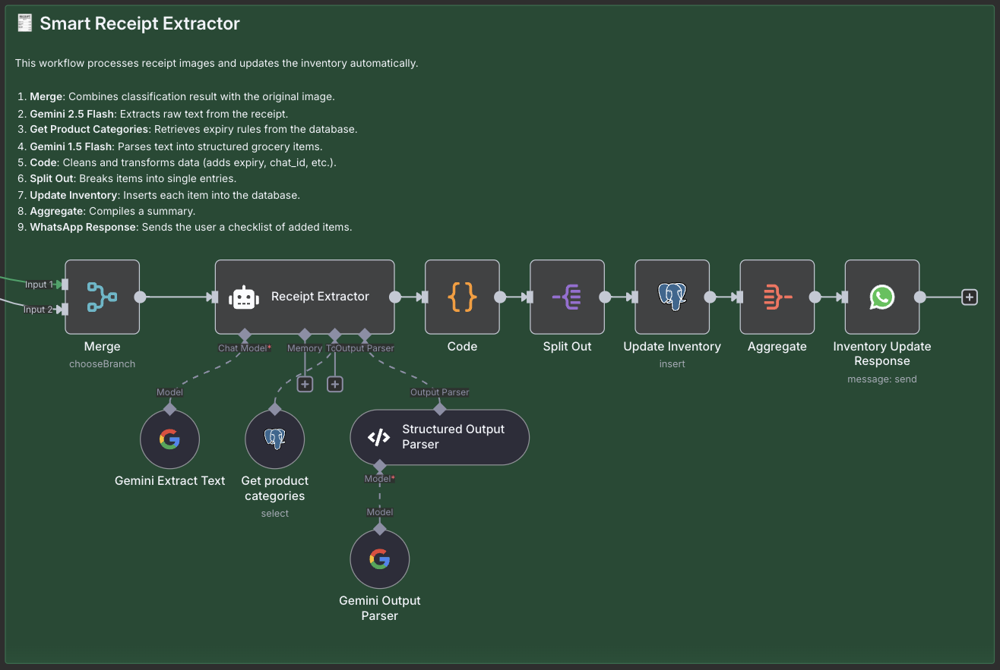

## 1. Background

As a student living in the UK, balancing study, life, and cooking has been a challenge. Between coursework, lectures, and late-night study sessions, I often forget what’s already sitting in my fridge. This leads to the all-too-familiar outcome: buying groceries I already have, letting things expire, and ultimately wasting food and money.

I wanted a solution that didn’t require me to change my habits or download new apps—just something that worked where I already spend time: **WhatsApp**.

## 2. The Solution

I built a **Grocery Assistant**—an AI-powered tool that helps me:

- Extract items from receipt images and store them in a live inventory table
- Remind me of expiring items and help generate grocery lists
- Communicate entirely through **WhatsApp**, which I already use daily

This means no extra app installations, no switching platforms—just smart grocery help through a familiar interface.

---

### 🧪 Demo

Below are three short demo clips that showcase the main features of the WhatsApp-based Grocery Assistant:

#### 📸 1. Receipt Upload → Inventory Update

A user sends a photo of a grocery receipt via WhatsApp. The assistant:
- Detects it as a receipt
- Extracts the items using AI
- Adds them to the inventory table
- Responds with a bullet-point confirmation of what was added

<video src="./demo/simulation1.mp4" width="1280" height="720" controls></video>

---

#### 🛒 2. Generate Grocery List from Expiring Items

The user asks, _“What should I buy?”_

The assistant checks for items that are low in quantity or expiring soon and replies with a smart grocery list.

<video src="./demo/simulation2.mp4" width="1280" height="720" controls></video>

---

#### ❌ 3. Upload Non-Receipt Image

A user sends a random photo (e.g. a street sign or a product box). The assistant:
- Classifies it as **not a receipt**
- Transcribes visible text (if any)
- Responds politely, explaining that no grocery extraction was possible

<video src="./demo/simulation3.mp4" width="1280" height="720" controls></video>

## 3. Prototyping with n8n

To build this fast, I used **n8n**, an open-source workflow automation tool. Why n8n?

- ✅ Low-code with visual logic
- ✅ Easy integration with WhatsApp (via Business API)
- ✅ Supports AI models and custom databases
- ✅ Fast iteration—I built and tested this in under **3 days**

For prototypes like this, n8n is perfect. It’s modular, visual, and allows integrating AI tools with databases, HTTP endpoints, and messaging platforms with minimal boilerplate.

---

## 4. Workflow Breakdown

Let me walk you through the system design, as shown in the visual below:

### 🟫 Grocery Assistant

When a user sends a text message, the **Grocery Assistant** (powered by Gemini 2.5 Flash) processes it. It chooses the right tool based on intent: whether it’s to create a grocery list, check for expiring items, or ask about what’s in stock.

✅ Tools used:
- `Postgres Chat Memory` to access inventory data  
- `Expiring Items` to check for near-expiry products  
- Replies are sent directly back via WhatsApp.

---

### 🟦 Image Classifier

If the input is an image (e.g., a photo of a receipt), it’s routed to the **Image Classifier**. This step uses Gemini 1.5 Flash to classify whether the image is a **receipt** or something else.

📌 Outcome:
- If it's a receipt → go to receipt extractor.
- If not → transcribe and send the text back with a polite fallback.

---

### 🟪 No Receipt Response

If the image is not a receipt, the system still makes use of it. The agent transcribes visible text using Gemini 1.5 Flash and replies via WhatsApp with the message:

> “This image does not appear to be a receipt, so no extraction was performed.”

This ensures a graceful fallback and lets users know what's happening.

---

### 🟩 Smart Receipt Extractor

When a valid receipt is detected, the image goes through the **Smart Receipt Extractor** workflow:

1. 🔗 Merge the binary image
2. 📄 Extract raw text using **Gemini 2.5 Flash**
3. 🗂️ Match products to known categories via database
4. 🧠 Parse structured items with **Gemini 1.5 Flash**
5. 🧹 Clean and transform the data (add expiry based on category shelf life)
6. 🔄 Split items for individual inserts
7. 🛒 Insert into PostgreSQL inventory
8. 📬 Aggregate and send a WhatsApp checklist of added items

Despite being entirely no-code, this workflow handles multi-model orchestration, structured output parsing, and real-time database updates.

---

## 5. Conclusion

The Grocery Assistant **works**—and it already saves me time and reduces food waste. It’s still a **prototype**, but the foundation is solid.

### 🛠️ What can be improved?

- Smarter expiry estimation with fine-tuned LLMs  
- Automatic correction for OCR errors  
- More personalized grocery list suggestions based on purchase history  
- Multi-language support for international receipts

### 🧠 Final Thoughts on n8n

n8n is fantastic for fast prototyping and workflow iteration. While I haven’t fully explored its **deployment scalability** yet, it gave me an MVP in under 3 days—a feat that would’ve taken much longer with scratch coding. However, for production-scale systems, I'd consider combining n8n with custom backend logic for more control and robustness.

### Did you find this page helpful? Consider sharing it 🙌